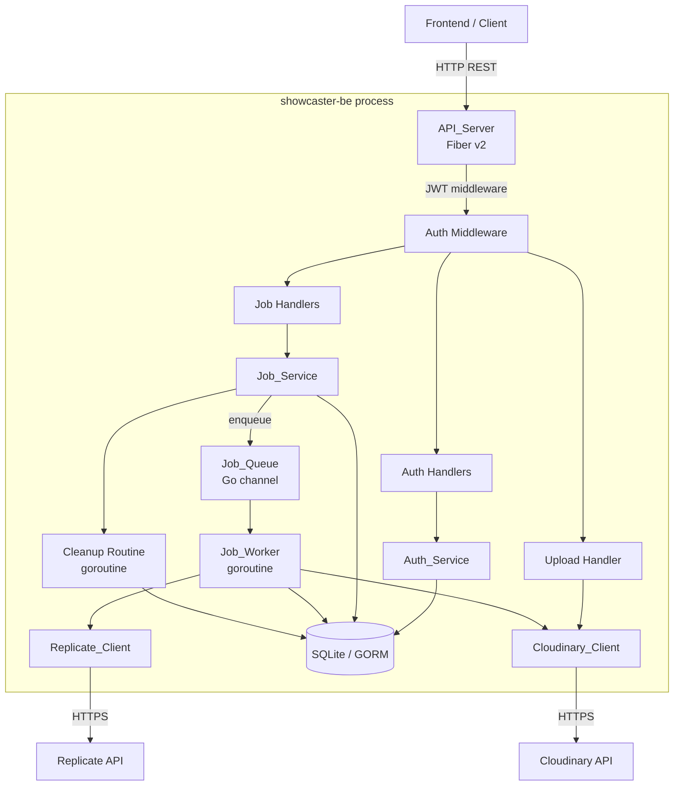

# Design Document: showcaster-be

## Overview

Showcaster Backend (`showcaster-be`) is a Go REST API service that powers the Showcaster AI affiliate video generation SaaS. It exposes a JSON API consumed by the Next.js frontend, handles user authentication via JWT, accepts video generation jobs, and processes them asynchronously through a 4-step pipeline (Hook → Problem → Solution → Closure) using the Replicate Wan 2.1 image-to-video model. Generated clips are stored in Cloudinary, and all state is persisted in SQLite via GORM.

### Key Design Goals

- **Non-blocking job submission**: HTTP handlers return immediately after enqueuing a job; all AI generation work happens in a background goroutine.
- **Simple deployment**: A single binary with SQLite — no external database or message broker required.
- **Fail-safe processing**: Per-step retry logic (3 attempts, 30 s interval) and a 10-minute Replicate timeout prevent jobs from hanging indefinitely.
- **Automatic housekeeping**: A 24-hour TTL cleanup routine deletes completed/failed jobs older than 5 days.

---

## Architecture

### High-Level Component Diagram



### Request Lifecycle

1. Client sends an authenticated request to the Fiber HTTP server.
2. JWT middleware validates the `Authorization: Bearer <token>` header and injects the `userID` into the request context.
3. The appropriate handler delegates to a service layer (`Auth_Service`, `Job_Service`).
4. For job submission, `Job_Service` creates DB records and sends the job to the `Job_Queue` channel.
5. The `Job_Worker` goroutine reads from the channel and drives the 4-step Replicate pipeline.
6. The frontend polls `GET /api/jobs/:id` to track progress.

### Concurrency Model

- **One `Job_Worker` goroutine** processes jobs sequentially. This keeps the design simple and avoids concurrent writes to the same job record. The channel buffer (size 100) absorbs bursts.
- **One `Cleanup Routine` goroutine** runs a `time.Ticker` every 24 hours.
- Both goroutines are started in `main()` and run for the lifetime of the process.

---

## Components and Interfaces

### API_Server

Built on [Fiber v2](https://github.com/gofiber/fiber). Responsible for:

- Registering all routes and middleware.
- Parsing and validating request bodies using `go-playground/validator`.
- Returning structured JSON error responses.
- Enforcing file size limits via Fiber's `BodyLimit` middleware.

**Route Registration**

```
POST   /api/auth/register
POST   /api/auth/login
POST   /api/auth/verify-otp
POST   /api/auth/resend-otp

GET    /health

--- JWT middleware applied below ---

POST   /api/upload/image

POST   /api/jobs/generate
GET    /api/jobs
GET    /api/jobs/:id
DELETE /api/jobs/:id
```

### Auth_Service

Handles user lifecycle: registration, login, OTP verification, and JWT issuance.

```go
type AuthService interface {
    Register(ctx context.Context, req RegisterRequest) error
    Login(ctx context.Context, req LoginRequest) (TokenResponse, error)
    VerifyOTP(ctx context.Context, req VerifyOTPRequest) (TokenResponse, error)
    ResendOTP(ctx context.Context, email string) error
}
```

Key behaviours:
- Passwords are hashed with `bcrypt` (cost 12) before storage.
- OTPs are 6-digit numeric codes stored alongside their creation timestamp and a failure counter.
- JWTs are signed with HS256 using `JWT_SECRET`; the `exp` claim is set to `iat + 86400`.
- Login and "email not found" responses return identical HTTP 401 bodies to prevent user enumeration.

### Job_Service

Manages job CRUD and enqueuing.

```go
type JobService interface {
    CreateJob(ctx context.Context, userID string, req CreateJobRequest) (CreateJobResponse, error)
    GetJob(ctx context.Context, userID, jobID string) (JobResponse, error)
    ListJobs(ctx context.Context, userID string, params PaginationParams) (JobListResponse, error)
    DeleteJob(ctx context.Context, userID, jobID string) error
}
```

`CreateJob` runs a GORM transaction that inserts one `Job` row and four `Step` rows atomically, then performs a non-blocking send to the `Job_Queue` channel.

### Job_Worker

A single goroutine started at process boot. Reads `Job` values from the `Job_Queue` channel and drives the pipeline.

```go
func (w *JobWorker) Run(ctx context.Context) {
    for job := range w.queue {
        w.processJob(ctx, job)
    }
}
```

**Step processing loop** (pseudo-code):

```
for each step in [Hook, Problem, Solution, Closure]:
    update step.status = processing
    for attempt in 1..3:
        videoURL, err = replicateClient.Generate(job, step)
        if err == nil:
            cloudinaryURL, err = cloudinaryClient.Upload(videoURL)
        if err == nil:
            atomically: step.status=completed, step.videoUrl=cloudinaryURL
                        job.progress = (completedCount/4)*100
            break
        if attempt == 3:
            step.status = failed
            job.status  = failed
            return
        sleep(30s)
update job.status = completed
```

### Replicate_Client

Wraps the Replicate HTTP API. Uses Go's `net/http` directly (no SDK dependency) to keep the binary lean.

```go
type ReplicateClient interface {
    Generate(ctx context.Context, job Job, stepName string) (videoURL string, err error)
}
```

Internally:
1. `POST https://api.replicate.com/v1/predictions` with model `wan-ai/wan2.1-i2v-480p` and all required inputs.
2. Poll `GET https://api.replicate.com/v1/predictions/{id}` every 5 seconds.
3. On `succeeded`: return `output[0]` URL.
4. On `failed`: return `ErrGenerationFailed`.
5. After 10 minutes without a terminal state: `POST https://api.replicate.com/v1/predictions/{id}/cancel`, return `ErrTimeout`.

All requests include `Authorization: Bearer <REPLICATE_API_TOKEN>`.

**Step prompts** (derived from step name):

| Step     | Prompt fragment                                                                 |
|----------|---------------------------------------------------------------------------------|
| Hook     | "Attention-grabbing opening scene showcasing {productName} for {targetAudience}" |
| Problem  | "Scene depicting the problem that {productName} solves for {targetAudience}"    |
| Solution | "Scene showing {productName} as the solution, highlighting key benefits"        |
| Closure  | "Compelling call-to-action closing scene for {productName}"                     |

### Cloudinary_Client

Wraps the Cloudinary upload API.

```go
type CloudinaryClient interface {
    UploadImage(ctx context.Context, r io.Reader, filename string) (url string, err error)
    UploadVideoFromURL(ctx context.Context, sourceURL string) (url string, err error)
}
```

Uses the official `cloudinary-community/cloudinary-go` SDK. Images are uploaded to the `showcaster/images` folder; generated videos to `showcaster/videos`.

### JWT Middleware

Uses `gofiber/contrib/jwt` backed by `golang-jwt/jwt/v5`.

```go
func JWTMiddleware(secret string) fiber.Handler {
    return jwtware.New(jwtware.Config{
        SigningKey: jwtware.SigningKey{Key: []byte(secret)},
        ErrorHandler: func(c *fiber.Ctx, err error) error {
            return c.Status(fiber.StatusUnauthorized).JSON(fiber.Map{
                "error": "unauthorized",
            })
        },
    })
}
```

After the middleware runs, handlers extract the user ID via:

```go
token := c.Locals("user").(*jwt.Token)
claims := token.Claims.(jwt.MapClaims)
userID := claims["sub"].(string)
```

### Cleanup Routine

```go
func StartCleanupRoutine(db *gorm.DB, logger *slog.Logger) {
    ticker := time.NewTicker(24 * time.Hour)
    go func() {
        for range ticker.C {
            runCleanup(db, logger)
        }
    }()
}
```

`runCleanup` executes a single GORM transaction:

```sql
DELETE FROM steps WHERE job_id IN (
    SELECT id FROM jobs
    WHERE status IN ('completed', 'failed')
    AND created_at < NOW() - INTERVAL '120 hours'
);
DELETE FROM jobs
WHERE status IN ('completed', 'failed')
AND created_at < NOW() - INTERVAL '120 hours';
```

On any DB error the transaction is rolled back, the error is logged, and the routine waits for the next tick.

---

## Data Models

### GORM Models

```go
// User represents a registered account.
type User struct {
    ID           string    `gorm:"primaryKey;type:text"`
    Email        string    `gorm:"uniqueIndex;not null;type:text"`
    FullName     string    `gorm:"not null;type:text"`
    PasswordHash string    `gorm:"not null;type:text"`
    IsVerified   bool      `gorm:"not null;default:false"`
    OTPCode      string    `gorm:"type:text"`
    OTPExpiresAt time.Time
    OTPFailCount int       `gorm:"not null;default:0"`
    CreatedAt    time.Time
    UpdatedAt    time.Time
}

// Job represents a single video generation request.
type Job struct {
    ID               string    `gorm:"primaryKey;type:text"`
    UserID           string    `gorm:"not null;index;type:text"`
    Status           string    `gorm:"not null;type:text;default:'pending'"`  // pending|processing|completed|failed
    Progress         int       `gorm:"not null;default:0"`
    ModelImageURL    string    `gorm:"not null;type:text"`
    ProductImageURL  string    `gorm:"not null;type:text"`
    ProductName      string    `gorm:"not null;type:text"`
    ProductCategory  string    `gorm:"not null;type:text"`
    TargetAudience   string    `gorm:"not null;type:text"`
    Orientation      string    `gorm:"not null;type:text"`
    Resolution       string    `gorm:"not null;type:text"`
    ThumbnailURL     string    `gorm:"type:text"`
    CreatedAt        time.Time
    UpdatedAt        time.Time
    Steps            []Step    `gorm:"foreignKey:JobID;constraint:OnDelete:CASCADE"`
    User             User      `gorm:"foreignKey:UserID"`
}

// Step represents one of the four pipeline segments of a Job.
type Step struct {
    ID        string    `gorm:"primaryKey;type:text"`
    JobID     string    `gorm:"not null;index;type:text"`
    Name      string    `gorm:"not null;type:text"`  // Hook|Problem|Solution|Closure
    Status    string    `gorm:"not null;type:text;default:'pending'"`  // pending|processing|completed|failed
    VideoURL  string    `gorm:"type:text"`
    CreatedAt time.Time
    UpdatedAt time.Time
}
```

### SQLite Schema (auto-migrated by GORM)

```sql
CREATE TABLE users (
    id            TEXT PRIMARY KEY,
    email         TEXT NOT NULL UNIQUE,
    full_name     TEXT NOT NULL,
    password_hash TEXT NOT NULL,
    is_verified   INTEGER NOT NULL DEFAULT 0,
    otp_code      TEXT,
    otp_expires_at DATETIME,
    otp_fail_count INTEGER NOT NULL DEFAULT 0,
    created_at    DATETIME,
    updated_at    DATETIME
);

CREATE TABLE jobs (
    id               TEXT PRIMARY KEY,
    user_id          TEXT NOT NULL REFERENCES users(id),
    status           TEXT NOT NULL DEFAULT 'pending',
    progress         INTEGER NOT NULL DEFAULT 0,
    model_image_url  TEXT NOT NULL,
    product_image_url TEXT NOT NULL,
    product_name     TEXT NOT NULL,
    product_category TEXT NOT NULL,
    target_audience  TEXT NOT NULL,
    orientation      TEXT NOT NULL,
    resolution       TEXT NOT NULL,
    thumbnail_url    TEXT,
    created_at       DATETIME,
    updated_at       DATETIME
);
CREATE INDEX idx_jobs_user_id ON jobs(user_id);
CREATE INDEX idx_jobs_status_created_at ON jobs(status, created_at);

CREATE TABLE steps (
    id         TEXT PRIMARY KEY,
    job_id     TEXT NOT NULL REFERENCES jobs(id) ON DELETE CASCADE,
    name       TEXT NOT NULL,
    status     TEXT NOT NULL DEFAULT 'pending',
    video_url  TEXT,
    created_at DATETIME,
    updated_at DATETIME
);
CREATE INDEX idx_steps_job_id ON steps(job_id);
```

### API Request / Response DTOs

```go
// Auth
type RegisterRequest struct {
    Email    string `json:"email"    validate:"required,email,max=254"`
    FullName string `json:"fullName" validate:"required,max=100"`
    Password string `json:"password" validate:"required,min=8,max=72"`
}

type LoginRequest struct {
    Email    string `json:"email"    validate:"required,email"`
    Password string `json:"password" validate:"required"`
}

type VerifyOTPRequest struct {
    Email string `json:"email" validate:"required,email"`
    OTP   string `json:"otp"   validate:"required,len=6,numeric"`
}

type TokenResponse struct {
    Token string `json:"token"`
}

// Jobs
type CreateJobRequest struct {
    ModelImageURL   string `json:"modelImageUrl"   validate:"required,url,startswith=https://"`
    ProductImageURL string `json:"productImageUrl" validate:"required,url,startswith=https://"`
    ProductName     string `json:"productName"     validate:"required,max=200"`
    ProductCategory string `json:"productCategory" validate:"required,oneof=beauty fashion electronics health"`
    TargetAudience  string `json:"targetAudience"  validate:"required,oneof=man woman children unisex"`
    Orientation     string `json:"orientation"     validate:"required,oneof=portrait landscape square"`
    Resolution      string `json:"resolution"      validate:"required,oneof=720p 1080p 4k"`
}

type JobResponse struct {
    ID        string         `json:"id"`
    Status    string         `json:"status"`
    Progress  int            `json:"progress"`
    Steps     []StepResponse `json:"steps"`
    CreatedAt time.Time      `json:"createdAt"`
}

type StepResponse struct {
    Name     string  `json:"name"`
    Status   string  `json:"status"`
    VideoURL *string `json:"videoUrl"`
}

type JobListResponse struct {
    Jobs  []JobSummary `json:"jobs"`
    Total int64        `json:"total,omitempty"`
    Page  int          `json:"page,omitempty"`
    Limit int          `json:"limit,omitempty"`
}

type JobSummary struct {
    ID           string    `json:"id"`
    Status       string    `json:"status"`
    CreatedAt    time.Time `json:"createdAt"`
    ThumbnailURL *string   `json:"thumbnailUrl"`
}
```

### Configuration

```go
type Config struct {
    Port                 int    // default: 8080
    JWTSecret            string // required
    ReplicateAPIToken    string // required
    CloudinaryCloudName  string // required
    CloudinaryAPIKey     string // required
    CloudinaryAPISecret  string // required
    DBPath               string // default: ./showcaster.db
}
```

---

## Project Directory Structure

```
apps/showcaster-be/
├── cmd/
│   └── server/
│       └── main.go              # Entry point: load config, wire deps, start server
├── internal/
│   ├── config/
│   │   └── config.go            # Env var loading and validation
│   ├── db/
│   │   └── db.go                # GORM SQLite connection and auto-migration
│   ├── models/
│   │   ├── user.go
│   │   ├── job.go
│   │   └── step.go
│   ├── dto/
│   │   ├── auth.go
│   │   └── job.go
│   ├── middleware/
│   │   └── jwt.go               # JWT middleware factory
│   ├── handlers/
│   │   ├── auth.go
│   │   ├── job.go
│   │   └── upload.go
│   ├── services/
│   │   ├── auth_service.go
│   │   └── job_service.go
│   ├── worker/
│   │   └── job_worker.go        # Job_Worker goroutine
│   ├── cleanup/
│   │   └── cleanup.go           # TTL cleanup routine
│   ├── clients/
│   │   ├── replicate.go         # Replicate_Client
│   │   └── cloudinary.go        # Cloudinary_Client
│   └── router/
│       └── router.go            # Route registration
├── go.mod
├── go.sum
└── README.md
```

### Key Dependencies

| Package | Purpose |
|---|---|
| `github.com/gofiber/fiber/v2` | HTTP server |
| `github.com/gofiber/contrib/jwt` | JWT middleware for Fiber |
| `github.com/golang-jwt/jwt/v5` | JWT signing/parsing |
| `gorm.io/gorm` | ORM |
| `gorm.io/driver/sqlite` | SQLite driver |
| `github.com/google/uuid` | UUID generation for IDs |
| `golang.org/x/crypto` | bcrypt password hashing |
| `github.com/go-playground/validator/v10` | Request validation |
| `github.com/cloudinary/cloudinary-go/v2` | Cloudinary uploads |
| `github.com/joho/godotenv` | `.env` file loading (dev only) |


---

## Correctness Properties

*A property is a characteristic or behavior that should hold true across all valid executions of a system — essentially, a formal statement about what the system should do. Properties serve as the bridge between human-readable specifications and machine-verifiable correctness guarantees.*

### Property 1: Registration creates a unique user record

*For any* valid registration payload (RFC 5322 email ≤ 254 chars, non-empty fullName ≤ 100 chars, password meeting complexity rules), calling `Register` should create exactly one user record in the DB with a bcrypt-hashed password and return HTTP 201. Registering a second time with the same email should return HTTP 409 without creating a duplicate record.

**Validates: Requirements 1.1, 1.2**

---

### Property 2: Password complexity validation rejects all non-conforming inputs

*For any* password string that is shorter than 8 characters, longer than 72 characters, or missing at least one uppercase letter, one lowercase letter, or one digit, the `Register` endpoint should return HTTP 400 identifying the `password` field as invalid.

**Validates: Requirements 1.4**

---

### Property 3: Login round-trip issues a correctly-formed JWT

*For any* registered and verified user, submitting their correct credentials to `POST /api/auth/login` should return HTTP 200 with a JWT whose `exp` claim equals `iat + 86400`. Submitting an incorrect password or a non-existent email should return HTTP 401 with an identical error body in both cases.

**Validates: Requirements 2.1, 2.2, 2.3, 2.4**

---

### Property 4: OTP verification is idempotent on failure and locks after 5 attempts

*For any* registered user with a valid OTP, submitting 5 incorrect OTPs should invalidate the OTP such that all subsequent attempts (including the correct OTP) return HTTP 400 indicating the OTP is no longer valid. Verifying a correct OTP on an already-verified account should return HTTP 409.

**Validates: Requirements 3.3, 3.5**

---

### Property 5: JWT middleware rejects all invalid tokens on protected routes

*For any* protected route (`/api/jobs/*`, `/api/upload/*`), a request with no `Authorization` header, a malformed `Authorization` header, an expired token, or a token signed with the wrong secret should return HTTP 401. A request with a valid JWT should have the correct `userID` extracted and made available to the handler.

**Validates: Requirements 4.1, 4.2, 4.3, 4.4**

---

### Property 6: Image upload validates file type and size before uploading

*For any* uploaded file, if its MIME type is not `image/jpeg` or `image/png` the endpoint should return HTTP 415. If its size exceeds 10 MB the endpoint should return HTTP 413. For any valid JPEG or PNG file ≤ 10 MB, the endpoint should call the Cloudinary_Client and return HTTP 200 with the resulting URL.

**Validates: Requirements 5.1, 5.2, 5.3, 5.4**

---

### Property 7: Job submission atomically creates one Job and four Steps

*For any* valid job creation payload, after a successful `POST /api/jobs/generate`, the DB should contain exactly one `Job` record with `status = pending` and exactly four `Step` records (Hook, Problem, Solution, Closure) each with `status = pending`, all sharing the same `job_id`. The response should be HTTP 202 with a UUID `jobId`.

**Validates: Requirements 6.1**

---

### Property 8: Job payload validation rejects all out-of-range and missing field inputs

*For any* job creation payload missing a required field, or containing a `productCategory` not in `[beauty, fashion, electronics, health]`, an `orientation` not in `[portrait, landscape, square]`, a `resolution` not in `[720p, 1080p, 4k]`, a `targetAudience` not in `[man, woman, children, unisex]`, a `productName` exceeding 200 characters, or a `modelImageUrl`/`productImageUrl` that is not a valid HTTPS URL, the endpoint should return HTTP 400 identifying the invalid field by name.

**Validates: Requirements 6.2, 6.3, 6.4, 6.5, 6.6, 6.7**

---

### Property 9: Job_Worker drives correct status transitions for every step

*For any* job processed by the Job_Worker, the DB status transitions must follow the sequence: `pending → processing → completed` (on success) or `pending → processing → failed` (on exhausted retries). The Job's `progress` field after `k` completed steps must equal `(k / 4) * 100`. Steps must be processed in the order Hook → Problem → Solution → Closure.

**Validates: Requirements 7.2, 7.3, 7.4, 7.5, 7.7**

---

### Property 10: Step retry logic exhausts exactly 3 attempts before marking failure

*For any* step where the Replicate_Client or Cloudinary_Client returns an error on every attempt, the Job_Worker should make exactly 3 attempts (with 30-second intervals between them) before setting `step.status = failed` and `job.status = failed`. No further attempts should be made after the third failure.

**Validates: Requirements 7.6, 7.9**

---

### Property 11: Replicate_Client constructs correct requests and handles all terminal states

*For any* job and step name, the Replicate_Client should include all required inputs in the prediction request and set `Authorization: Bearer <token>` on every outgoing request. When the prediction status is `succeeded`, it should return the output URL. When the status is `failed`, it should return `ErrGenerationFailed`. When no terminal state is reached within 10 minutes, it should send a cancellation request and return `ErrTimeout` (distinguishable from `ErrGenerationFailed`).

**Validates: Requirements 8.1, 8.2, 8.3, 8.4, 8.5**

---

### Property 12: Job access enforces ownership — cross-user requests return 403

*For any* job owned by user A, a GET or DELETE request authenticated as user B should return HTTP 403. A GET or DELETE request authenticated as user A should succeed (200 or 204 respectively, assuming valid job state for deletion).

**Validates: Requirements 9.3, 11.3**

---

### Property 13: Job list returns only the authenticated user's jobs in descending order

*For any* two users each with N and M jobs respectively, `GET /api/jobs` for user A should return exactly min(N, 100) jobs all belonging to user A, ordered by `createdAt` descending. User B's jobs must not appear in user A's response.

**Validates: Requirements 10.1, 10.2**

---

### Property 14: Pagination returns the correct subset and metadata

*For any* user with T total jobs and any valid `page` (≥ 1) and `limit` (0–100) query parameters, the response should contain exactly `min(limit, max(0, T - (page-1)*limit))` jobs and include `total = T`, `page`, and `limit` in the response body.

**Validates: Requirements 10.4**

---

### Property 15: Job deletion is atomic and respects status constraints

*For any* job with `status = completed` or `status = failed` belonging to the authenticated user, a DELETE request should atomically remove the job and all associated steps from the DB and return HTTP 204. For any job with `status = pending` or `status = processing`, DELETE should return HTTP 409.

**Validates: Requirements 11.1, 11.4**

---

### Property 16: TTL cleanup deletes exactly the right jobs

*For any* set of jobs in the DB with varying statuses and ages, after the cleanup routine runs, all jobs with `status IN (completed, failed)` and `created_at < now - 120h` should be absent from the DB, along with their steps. All other jobs (pending, processing, or younger than 120h) should remain untouched.

**Validates: Requirements 12.2**

---

### Property 17: Config validation rejects missing required environment variables

*For any* startup configuration where one or more of `JWT_SECRET`, `REPLICATE_API_TOKEN`, `CLOUDINARY_CLOUD_NAME`, `CLOUDINARY_API_KEY`, `CLOUDINARY_API_SECRET` is absent or empty, the server should exit with a non-zero status code and log the name of the missing variable. For any `PORT` value that is not an integer in the range 1–65535, the server should also exit with a non-zero status code.

**Validates: Requirements 14.2, 14.5**


---

## Error Handling

### Structured Error Response

All error responses use a consistent JSON envelope:

```json
{
  "error": "human-readable message",
  "field": "fieldName"   // optional, present for validation errors
}
```

### HTTP Status Code Mapping

| Scenario | Status |
|---|---|
| Validation failure (missing/invalid field) | 400 |
| Invalid credentials / bad token | 401 |
| Ownership mismatch | 403 |
| Resource not found | 404 |
| Conflict (duplicate email, already verified, job in progress) | 409 |
| File too large | 413 |
| Unsupported media type | 415 |
| Job queue full | 503 |
| Upstream service failure (Cloudinary, Replicate) | 502 |
| DB unavailable | 503 |

### Sentinel Error Types

The `Replicate_Client` returns typed errors to allow the `Job_Worker` to distinguish failure modes:

```go
var (
    ErrGenerationFailed = errors.New("replicate: prediction failed")
    ErrTimeout          = errors.New("replicate: prediction timed out")
)
```

### Panic Recovery

Fiber's built-in `Recover` middleware is enabled to catch any unhandled panics in handlers and return HTTP 500 rather than crashing the process.

### DB Unavailability

Service methods that require DB access wrap GORM errors and return HTTP 503 when the error indicates the DB is unreachable. The health check endpoint uses a 2-second context deadline for the DB ping.

### Job_Worker Error Isolation

Errors within `processJob` are fully contained — a panic or unrecoverable error in one job's processing must not crash the worker goroutine or affect other jobs. A `recover()` wrapper around `processJob` logs the panic and marks the job as `failed`.

---

## Testing Strategy

### Dual Testing Approach

Both unit/example-based tests and property-based tests are used:

- **Unit tests** cover specific examples, edge cases, error conditions, and integration points.
- **Property-based tests** verify universal invariants across randomly generated inputs.

### Property-Based Testing Library

Use **[`pgregory.net/rapid`](https://github.com/flyingmutant/rapid)** — a pure-Go property-based testing library with no external dependencies, good SQLite compatibility, and idiomatic Go API.

Each property test runs a minimum of **100 iterations**.

Tag format for each property test:

```go
// Feature: showcaster-be, Property N: <property_text>
```

### Unit Test Coverage

| Component | Test Focus |
|---|---|
| `config` | Missing required vars exit non-zero; defaults applied for PORT and DB_PATH |
| `Auth_Service` | Registration, login, OTP verification with mocked DB |
| `Job_Service` | CreateJob transaction, GetJob ownership, ListJobs pagination, DeleteJob state checks |
| `Job_Worker` | Step sequencing, retry logic (mock Replicate/Cloudinary), status transitions |
| `Replicate_Client` | Request construction, polling loop, timeout/cancel, error type distinction |
| `Cloudinary_Client` | Upload success and failure paths |
| `JWT Middleware` | Valid token extraction, invalid/expired/wrong-key rejection |
| `Cleanup Routine` | Correct age/status filtering, rollback on mid-run DB failure |
| `Health Handler` | 200 on ping success, 503 on ping failure/timeout |

### Property Test Mapping

| Property | Test File | Generator |
|---|---|---|
| P1: Registration uniqueness | `auth_service_test.go` | Random valid email/name/password tuples |
| P2: Password complexity | `auth_service_test.go` | Passwords violating each rule |
| P3: Login JWT round-trip | `auth_service_test.go` | Random registered users |
| P4: OTP lockout | `auth_service_test.go` | Random wrong OTP sequences |
| P5: JWT middleware | `middleware_test.go` | Random tokens (valid, expired, wrong-key) |
| P6: Image upload validation | `upload_handler_test.go` | Random file sizes and MIME types |
| P7: Job creation atomicity | `job_service_test.go` | Random valid job payloads |
| P8: Job payload validation | `job_service_test.go` | Payloads with each field invalid |
| P9: Status transitions | `job_worker_test.go` | Mock Replicate with random success/fail patterns |
| P10: Retry exhaustion | `job_worker_test.go` | Mock Replicate always failing |
| P11: Replicate request correctness | `replicate_client_test.go` | Random job/step combinations |
| P12: Cross-user 403 | `job_service_test.go` | Random pairs of users and jobs |
| P13: Job list isolation | `job_service_test.go` | Random multi-user job sets |
| P14: Pagination correctness | `job_service_test.go` | Random page/limit/total combinations |
| P15: Deletion atomicity | `job_service_test.go` | Random completed/failed/in-progress jobs |
| P16: TTL cleanup precision | `cleanup_test.go` | Random job sets with varying ages and statuses |
| P17: Config validation | `config_test.go` | Each required var absent or invalid PORT values |

### Integration Tests

A small set of integration tests (using an in-memory SQLite instance) verify:

- Full registration → OTP verification → login flow.
- Full job submission → worker processing → status polling flow (with mocked Replicate and Cloudinary).
- Health check endpoint with real DB connection.

### Test Execution

```bash
# Run all tests (unit + property)
go test ./...

# Run with race detector
go test -race ./...

# Run property tests with more iterations
RAPID_CHECKS=500 go test ./...
```

